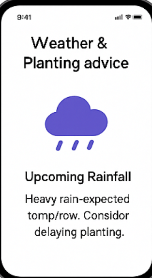
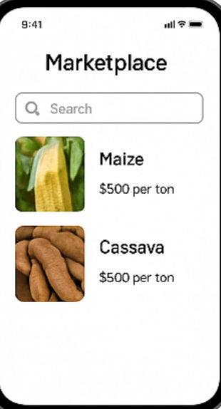
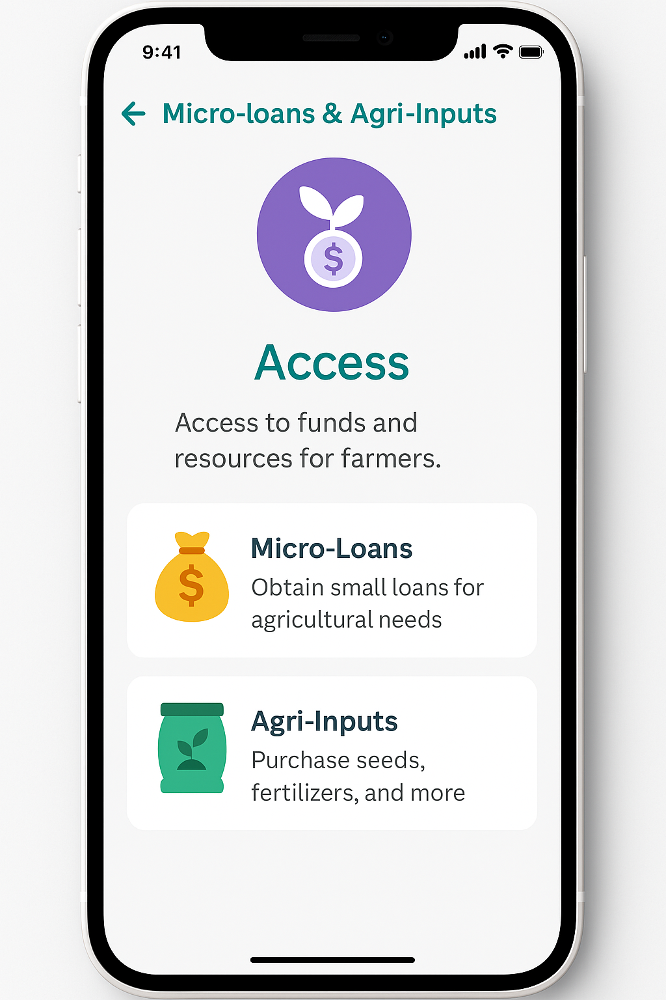

# 🌱 AgriLink - Smart Agriculture Platform
AgriLink is a smart agriculture web application designed to revolutionize how farmers plan, grow, sell, and thrive. Powered by AI and built with the modern MERN stack, AgriLink provides intelligent crop recommendations, microloan access, digital agri-input shopping, and a farmer-to-farmer marketplace — all in one integrated ecosystem.

---

## 🌟 Features

### 🧠 AI Crop Assistant
Get personalized crop planting advice using real-time data about:
- Your region
- Soil type
- Weather conditions
- Market trends

### 📦 Agri Inputs Store
- Browse essential farming supplies.
- Add items to cart and simulate orders.

### 🏪 Farmer Marketplace
- List and browse fresh produce for sale.
- Filter listings by category, region, or crop type.

### 💸 Microloans for Farmers
- Apply for short-term agricultural loans.
- View loan approval status and history.

### 🌤️ Weather Updates
- Real-time local weather forecasts to help plan your farming activities.

### 🔐 Authentication
- Secure login and registration using JWT.
- Protected routes for logged-in users.

---

## 🧑‍💻 Tech Stack

| Layer         | Tech                             |
|---------------|----------------------------------|
| Frontend      | React + TypeScript, TailwindCSS  |
| Backend       | Node.js + Express + TypeScript   |
| Database      | MongoDB Atlas                    |
| AI Assistant  | OpenAI API / Rule-based logic    |
| Weather API   | OpenWeatherMap API (or similar)  |
| Deployment    | Vercel (Frontend), Render (Backend) |

---

## 📁 Folder Structure
```
AgriLink/
├── backend/ # Express API with TypeScript
│ ├── controllers/
│ ├── routes/
│ ├── models/
│ ├── middlewares/
│ ├── config/
│ ├── utils/
│ └── server.ts
├── frontend/ # React + TS + TailwindCSS (Vite)
│ ├── src/
│ │ ├── components/
│ │ ├── pages/
│ │ ├── hooks/
│ │ ├── services/
│ │ ├── store/
│ │ ├── App.tsx
│ │ └── main.tsx
│ └── tailwind.config.js
├── .env
├── package.json
└── README.md
```
## 🚀 Getting Started
```
### ✅ Prerequisites

- Node.js v18+
- pnpm (`npm install -g pnpm`)
- MongoDB Atlas account
- OpenAI API key

---

## 📦 Installation

### 1. Clone the Repo

git clone https://github.com/PLP-MERN-Stack-Development/week-8-capstone_-RebMir.git
cd field-wise-aid

---

2️⃣ Setup Backend

cd backend
pnpm install
---

Create a .env file and add:
PORT=5000
MONGO_URI=your_mongodb_atlas_uri
JWT_SECRET=your_jwt_secret
OPENAI_API_KEY=your_openai_api_key
---

Run development server:
pnpm run dev
---

3️⃣ Setup Frontend
cd ../frontend
pnpm install
---

Start the Vite dev server:
pnpm run dev
---

### ✅ Environment Variables
Create a .env file in the backend directory:
PORT=5000
MONGO_URI=mongodb+srv://<username>:<password>@cluster.mongodb.net/agrilink
JWT_SECRET=your_jwt_secret
OPENAI_API_KEY=your_api_key
WEATHER_API_KEY=your_weather_api_key

```
🧪 Testing

Frontend: React Testing Library, Vitest

Backend: Jest, Supertest

E2E: Cypress

## 🛠️ Future Improvements

- 🌍 Multi-language support

- 🔔 Notifications (loan updates, AI tips)

- 📱 Mobile responsive improvements

- 💳 Payment gateway for real orders

- 👩‍🌾 Admin dashboard for monitoring

### 🧑‍🎓 Contributing
- Fork the repo

- Create your feature branch (git checkout -b feature-name)

- Commit your changes (git commit -m 'Add new feature')

- Push to the branch (git push origin feature-name)

- Create a Pull Request


## 📸 Screenshot





